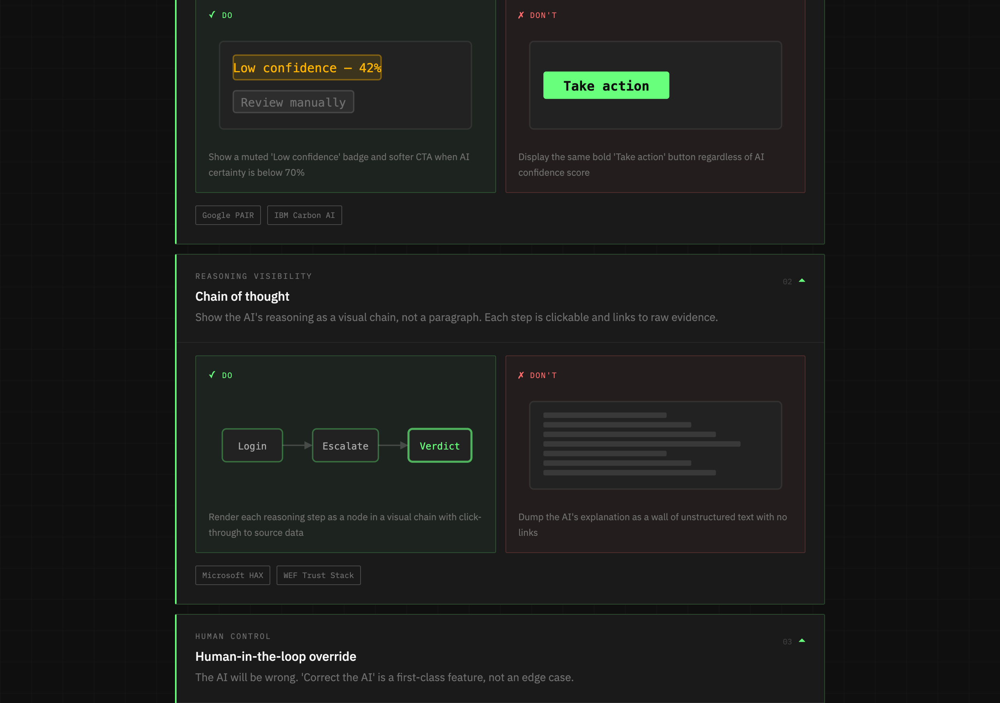
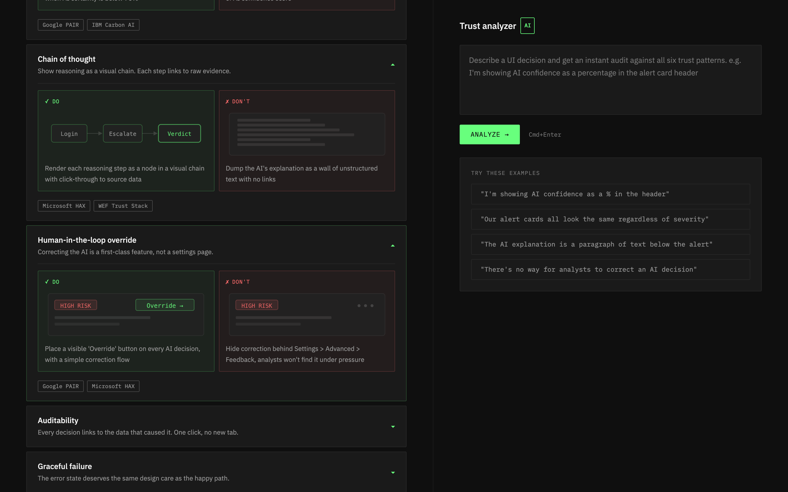

# Trust Lens

> A reference tool and live analyzer for product designers building AI interfaces that security analysts can actually trust.



---

## Why this exists

Most AI products are designed for the happy path.
Trust Lens is built around what happens when the AI is wrong, uncertain, or needs a human to intervene.

Six evidence-based design patterns, grounded in Google PAIR, Microsoft HAX, IBM Carbon for AI, and the WEF Trust Stack — with a live AI analyzer that audits your design decisions against them.

---

## Features

- **6 Trust Patterns** — Confidence calibration, Chain of thought visibility, Human-in-the-loop override, Auditability, Graceful failure, Alert fatigue reduction
- **Visual DO/DON'T examples** — Each pattern includes illustrated mockups, not just text
- **Live Trust Analyzer** — Describe your UI, get an instant audit against all six patterns powered by Llama 3 via Groq
- **Framework references** — Every pattern links back to Google PAIR, Microsoft HAX, IBM Carbon, or WEF Trust Stack
- **Built for designers** — IBM Carbon dark aesthetic, no engineering jargon

---

## Demo

[LIVE DEMO LINK — add after Vercel deploy]



---

## Getting started

### Prerequisites

- Node.js 18+
- A Groq API key — free at [console.groq.com](https://console.groq.com)

### Install

```bash
git clone https://github.com/[YOUR_USERNAME]/trust-lens
cd trust-lens
npm install
```

### Configure

```bash
cp .env.example .env
```

Open `.env` and add your Groq API key:

```
GROQ_API_KEY=your_key_here
```

### Run

```bash
npm run dev
```

Open [http://localhost:5173](http://localhost:5173)

---

## The six trust patterns

| Pattern | Core principle |
|---|---|
| Confidence calibration | UI must change based on AI certainty |
| Chain of thought | Show reasoning as visual chain, not text |
| Human-in-the-loop | Override is a first-class feature |
| Auditability | Every decision links to raw evidence |
| Graceful failure | Design the wrong path as carefully as the right one |
| Alert fatigue | Real threats must break the visual pattern |

---

## Tech stack

- React + Vite
- Tailwind CSS v3
- IBM Plex Sans + IBM Plex Mono
- Anthropic Claude API (`claude-sonnet-4-20250514`)

---

## Contributing

This is an open-source, community-maintained pattern library.

**To propose a new trust pattern:**
1. Open an issue using the Pattern Proposal template
2. Include: pattern name, core principle, DO example, DON'T example, framework reference
3. If accepted, submit a PR adding it to the patterns array in `App.jsx`

**To improve existing patterns:**
Open a PR with your changes and reasoning.

All contributors will be credited.

---

## Roadmap

- [ ] Pattern scoring across all six pillars simultaneously
- [ ] Multi-turn analyzer with follow-up questions
- [ ] Figma plugin version
- [ ] Community pattern submissions
- [ ] Export audit report as PDF

---

## Built by

Adam — AI-Native Senior Product Designer
[adamgoddenyu.com](https://adamgoddenyu.com)

Built with Claude Code + Cursor

---

## License

MIT — use it, fork it, build on it.
